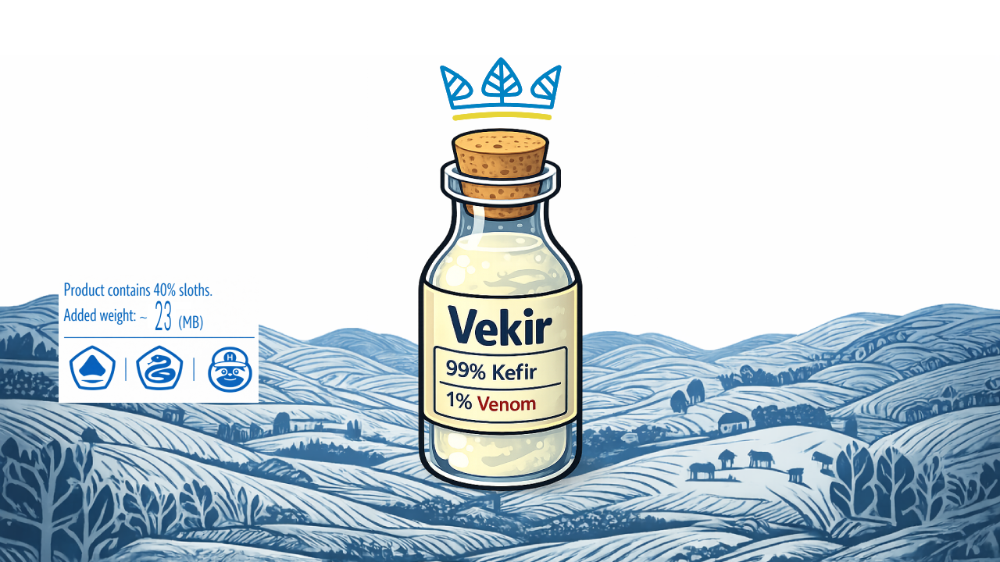

# Vekir




## Italiano

`Vekir` e un patch-pack ibrido pensato per chi usa quotidianamente sia Kefir che NX-Venom.

Obiettivo:
- mantenere la stabilita e la leggerezza tipiche di Kefir
- integrare le funzioni migliori di NX-Venom, soprattutto overclock e HUD
- mantenere un flusso di update semplice e affidabile

### Filosofia

Vekir non sostituisce i due progetti originali: li rispetta e li usa come base tecnica.

- `Kefir` come fondazione stabile e pipeline di aggiornamento
- `NX-Venom` come riferimento per HUD, toolset e personalizzazione avanzata

### Struttura Pack

- `bootloader/ini/vekir.ini`: voce Hekate per avvio rapido Vekir
- `startup.te`: autorun TegraExplorer (one-shot)
- `switch/vekir/apply_remix.te`: script principale (HUD + import selettivi)
- `switch/vekir/commands_menu.ini`: menu comandi safe
- `switch/vekir/system_tweaks_bootlogo_config.ini`: menu bootlogo esteso
- `switch/vekir/bootlogo/`: asset bootlogo Vekir (`Light` / `Black`)

### Workflow Consigliato

1. Scarica `Vekir-full.zip` dall'ultima release.
2. Estrai in root SD.
3. Avvia `kefir-updater` (installer Kefir).
4. A fine installer, Vekir viene schedulato automaticamente:
   `reboot su TegraExplorer -> apply script -> reboot finale`.
5. Facoltativo: tieni un pack Venom in `sd:/venom/` per override file dinamici.

### Update Pipeline

Vekir usa la pipeline di update di `Kefir`.

- Update pack/sistema: usa `kefir-updater`
- Uberhand updater e disattivato in Vekir per evitare falsi `Processing -> Done` su componenti non tracciati da repo
- Per download diretto del pack Vekir e supportato anche `AIO Switch Updater`

Nel menu comandi root di Uberhand, Vekir mantiene sempre queste voci in ordine:
1. `Hekate USB Mass Storage`
2. `Reboot`
3. `Shutdown`

Nota: `Hekate USB Mass Storage` richiede supporto `reboot UMS` nello stack in uso.

### Baseline Versioni

La baseline attuale del pack Vekir include:
- Atmosphere `1.10.2`
- hekate `v6.5.0`
- Nyx `v1.9.0`

### Aggiornamento Maintainer

Quando esce una nuova versione Kefir:

1. Scarica il nuovo zip Kefir ufficiale.
2. Esegui il builder:

```bash
./scripts/build_vekir_full.sh --kefir-zip /percorso/Kefir.zip --version 19.0.X
```

3. Trovi l'output in:
- `.release/Vekir-full-19.0.X.zip`
- `.release/Vekir-full.zip`

Il builder applica automaticamente la chain:
`Kefir installer -> schedule Vekir apply -> TegraExplorer -> reboot finale`.

### Build e Release

Il workflow [`.github/workflows/vekir-auto-release.yml`](./.github/workflows/vekir-auto-release.yml) gestisce la build/release in modalita manuale:
- prende l'ultima release di Kefir
- usa i componenti Venom mantenuti nel repository e aggiornati manualmente quando necessario
- builda `Vekir-full`
- pubblica release GitHub con `Vekir.zip` e `Vekir-full-kfX-vxY.zip`

Modalita:
- `Manuale`: GitHub -> Actions -> `Vekir Auto Release` -> Run workflow

### Requisiti Pratici

- emuMMC gia funzionante
- TegraExplorer disponibile in `sd:/bootloader/payloads/TegraExplorer.bin`
- asset Venom opzionali in `sd:/venom/` per override personalizzati

### Crediti

Questo progetto e un omaggio diretto ai maintainer e alle community di:

- Kefir: [rashevskyv/kefir](https://github.com/rashevskyv/kefir)
- Kefir Updater: [rashevskyv/kefir-updater](https://github.com/rashevskyv/kefir-updater)
- NX-Venom: [CatcherITGF/NX-Venom](https://github.com/CatcherITGF/NX-Venom)

Vekir non rivendica paternita sui componenti originali: li integra in modo selettivo per un setup personale coerente e mantenibile.

### Note

- Il menu AIO (`preserve.txt`) serve a preservare file/config scelti durante update via AIO.
- I bootlogo Hekate devono essere BMP `720x1280` a `32-bit`.
- Se copi da macOS, usa `scripts/push_remix_to_switch_sd.sh`: pulisce automaticamente `.DS_Store` e `._*` sulla SD.

## English

`Vekir` is a hybrid patch pack for users who rely on both Kefir and NX-Venom every day.

Goal:
- keep the stability and lightweight feel of Kefir
- bring in the best NX-Venom features, especially overclocking and HUD tooling
- keep the update flow simple and reliable

### Philosophy

Vekir does not replace the original projects. It builds on them with a controlled integration model.

- `Kefir` as the stable foundation and update pipeline
- `NX-Venom` as the reference for HUD, tooling, and advanced customization

### Pack Structure

- `bootloader/ini/vekir.ini`: Hekate entry for quick Vekir boot
- `startup.te`: one-shot TegraExplorer autorun
- `switch/vekir/apply_remix.te`: main script (HUD + selective imports)
- `switch/vekir/commands_menu.ini`: safe commands menu
- `switch/vekir/system_tweaks_bootlogo_config.ini`: extended bootlogo menu
- `switch/vekir/bootlogo/`: Vekir bootlogo assets (`Light` / `Black`)

### Recommended Workflow

1. Download `Vekir-full.zip` from the latest release.
2. Extract it to the SD root.
3. Launch `kefir-updater` (the Kefir installer).
4. After the installer finishes, Vekir is scheduled automatically:
   `reboot to TegraExplorer -> apply script -> final reboot`.
5. Optional: keep a Venom pack in `sd:/venom/` for dynamic file overrides.

### Update Pipeline

Vekir uses the `Kefir` update pipeline.

- Pack/system updates: use `kefir-updater`
- Uberhand updater is disabled in Vekir to avoid false `Processing -> Done` states on repo-untracked components
- `AIO Switch Updater` can also be used for direct Vekir pack downloads

In the Uberhand root commands page, Vekir always keeps these entries in order:
1. `Hekate USB Mass Storage`
2. `Reboot`
3. `Shutdown`

Note: `Hekate USB Mass Storage` requires `reboot UMS` support in the running stack.

### Baseline Versions

The current Vekir baseline includes:
- Atmosphere `1.10.2`
- hekate `v6.5.0`
- Nyx `v1.9.0`

### Maintainer Update Flow

When a new Kefir version is released:

1. Download the new official Kefir zip.
2. Run the builder:

```bash
./scripts/build_vekir_full.sh --kefir-zip /path/to/Kefir.zip --version 19.0.X
```

3. Output artifacts are written to:
- `.release/Vekir-full-19.0.X.zip`
- `.release/Vekir-full.zip`

The builder automatically applies this chain:
`Kefir installer -> schedule Vekir apply -> TegraExplorer -> final reboot`.

### Build and Release

The workflow [`.github/workflows/vekir-auto-release.yml`](./.github/workflows/vekir-auto-release.yml) handles build/release in manual mode:
- fetches the latest Kefir release
- uses Venom components already maintained in the repository and updated manually when needed
- builds `Vekir-full`
- publishes GitHub release assets as `Vekir.zip` and `Vekir-full-kfX-vxY.zip`

Mode:
- `Manual`: GitHub -> Actions -> `Vekir Auto Release` -> Run workflow

### Practical Requirements

- a working emuMMC setup
- TegraExplorer available at `sd:/bootloader/payloads/TegraExplorer.bin`
- optional Venom assets in `sd:/venom/` for custom overrides

### Credits

This project is a direct tribute to the maintainers and communities behind:

- Kefir: [rashevskyv/kefir](https://github.com/rashevskyv/kefir)
- Kefir Updater: [rashevskyv/kefir-updater](https://github.com/rashevskyv/kefir-updater)
- NX-Venom: [CatcherITGF/NX-Venom](https://github.com/CatcherITGF/NX-Venom)

Vekir does not claim ownership of the original components. It integrates them selectively into a coherent, maintainable personal setup.

### Notes

- The AIO menu (`preserve.txt`) preserves selected files/configs during AIO updates.
- Hekate bootlogos must be `720x1280` `32-bit` BMP files.
- When copying from macOS, use `scripts/push_remix_to_switch_sd.sh`: it cleans `.DS_Store` and `._*` files from the SD.
